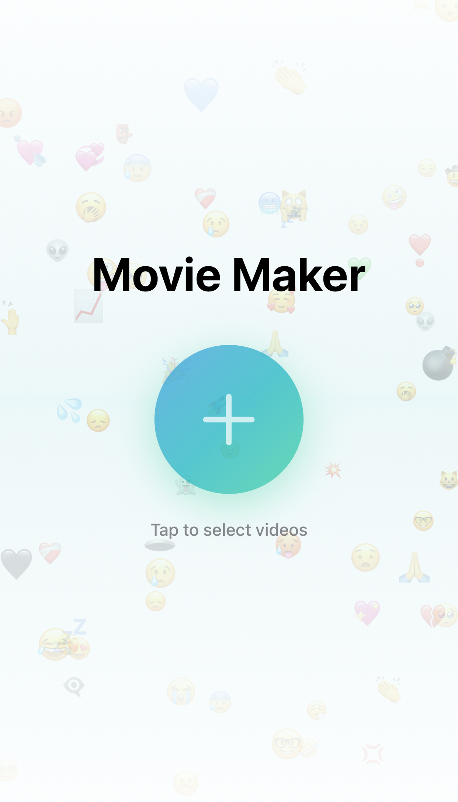
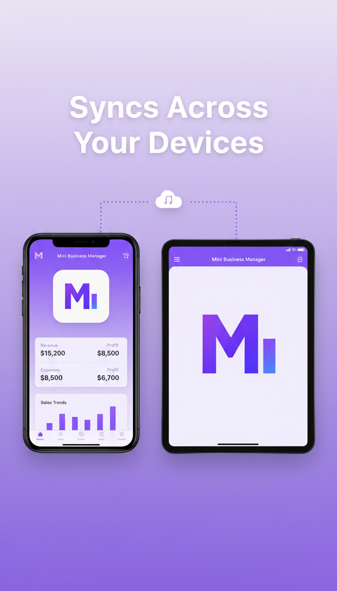

# *Christian Okeke*

**IT Director | Process Innovator | App Developer** — I lead digital transformation at Healing Hands Healthcare while building full-stack applications from iOS apps to web platforms for profit, research and growth.

---

[Visit LLC →](https://okeke.us)

-

[Visit Dev Portfolio →](https://sundai.us)

---

https://github.com/user-attachments/assets/2396741f-c347-4280-8d95-f1f6cce4cdba

---

## Business Solutions

Enterprise applications built for healthcare and field service industries.

| MedRec | TitanPDF |
|:---:|:---:|
|  |  |
| HIPAA-compliant clinical document review platform with AI-powered data extraction and Microsoft Azure AD integration. | Professional PDF form editor with ServiceTitan integration for field technicians. Signature capture and tablet support. |

  

---

## iOS Apps

Swift applications available on the App Store.

| MovieMaker | PixelLearn | MBM |
|:---:|:---:|:---:|
|  |  |  |
| Create videos easily with trimming, slow motion, and background music. | Educational game for kids with adaptive difficulty, math quizzes, and memory games. | Invoice management, expense tracking, and business analytics for small businesses. |
|  |  |  |

---

## Websites

https://github.com/user-attachments/assets/cace4c87-c4f0-4620-9367-b68f4a8863b0

<a href="https://github.com/okekedev/Globe3D"><strong>Globe3D</strong></a> 
Interactive 3D kiosk globe for trade shows and events. Real-time visitor tracking with Mapbox.

---

## Other Projects

| Sundai EQ | Sundai Radio |
|:---:|:---:|
|  |  |
| Chrome extension for YouTube audio equalization. Bass boost, treble control, and custom presets. | Retro-styled web radio player with curated Christian music channels. Built with Python/Dash. |

---
### Tech Stack

